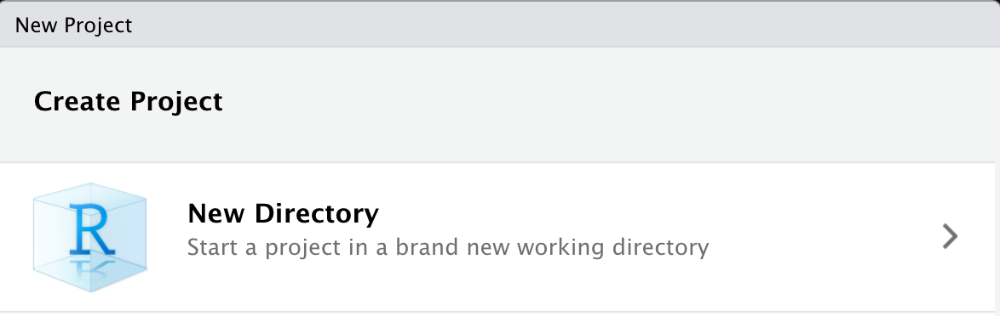

```{r setup, include=FALSE}
options(htmltools.dir.version = FALSE)
set.seed(100)
library(tidyverse)
library(here)

options(tibble.print_min = 4)
```

```{r functions, include = FALSE}
colorise <- function(x, color) {
  if (knitr::is_latex_output()) {
    sprintf("\\textcolor{%s}{%s}", color, x)
  } else if (knitr::is_html_output()) {
    sprintf("<span style='color: %s;'>%s</span>", color, 
      x)
  } else x
}
```

# Starting a New Project

Assuming you're using a local installation of R/RStudio:

- Make a folder somewhere on your computer.
- Open RStudio.
- **Click File $\rightarrow$ New Project $\rightarrow$ New Directory $\rightarrow$ New Project**.
- Give this a name (e.g. "managing-data") and save it somewhere you can access on your computer (e.g. Desktop)

Assuming you're using rstudio.cloud:

- Make a new Space and give it a name, then **click New Project**.

You now have a **folder and an rstudio project** for your work. You can put data and code in here, and all outputs will be saved in this place.

```{r project-directory, echo = FALSE, out.width = 350, fig.align = "center", fig.cap="creating a new project"}

```

---
# Create a New R Markdown File

Create a new R Markdown file. If you want your html file to update in real time, make it an **html notebook**. If you want it to only update when compiled, make it an **html document**.

e.g. Click File $\rightarrow$ New File $\rightarrow$ R Notebook. This will open an R notebook in the Editor.

```{r rstudio-interface, echo = FALSE, out.width = 500, fig.align = "center", fig.cap="RStudio Interface"}
knitr::include_graphics(c(
   "../../img/rstudio-interface.png"
))
```

---
# Understanding File Systems

Before we read in any data, it probably makes sense to understand file paths on your computer.

- Computers are often split up into different **drives** where you can store data: e.g. a C drive on a PC, a Macintosh HD drive on newer Macs. 

- The more drives you have, the more places data can live.

- Files are stored at unique **paths** (places) on these drives.

---
# Understanding File Systems

Let's say we have a file on our Desktop called "document.txt". This is a text file (.txt extension). 

How does the computer know where it is though? 

- On a PC, it might live at `C:\Users\glenn\desktop\document.txt`.

- Another file, "document2.txt" on the Desktop, would live at `C:\Users\glenn\desktop\document2.txt`.

You need to be able to **uniquely identify** files within file paths. That's why these files need unique names when in the same location, but could have the same name if in different paths (e.g. folders on the Desktop).

---
# How R Reads Files

By default, R will either ask you to:

- Specify the exact file path to access a file (e.g. `C:\Users\glenn\desktop\document.txt`), or...

- Specify a file path **relative** to the **working directory**.

The second method is generally best if you want your code to work on someone else's computer. Why? I can guarantee that I won't share my code with another `User` called `glenn`.

Where's the **working directory** though? This is where it gets awkward...

---
# The Working Directory

- The working directory in R by default is wherever you open up an R file, or wherever R is installed if you open it without first opening a file.

- This is obviously awkard. **Depending on how you start R, it could be anywhere!**

- RStudio Projects and the `here` package to the rescue!

- If you open an RStudio Project, your working directory is wherever the project is.

- If you read files in with `here`, no matter where your working directory is right now, it reads files **relative** to where the RStudio Project lives.

---
# Projects and Here: An Example

What if we want to read a file called **raw_data.csv** from a folder on our **desktop** called **my_data**?

.pull-left[

## Without Project and Here

Method one will only work on my PC. Method two will only work if you know your working directory is on Desktop. (It probably isn't.)

```{r read-no-here, eval=FALSE}
# using absolute paths
read_csv(
  "C:/Users/glenn/Desktop
  /my_data/raw_data.csv"
)

# using relative paths if
# the directory is Dekstop
read_csv("my_data/raw_data.csv")
```

]

.pull-right[

## With Project and Here

Assuming you have a folder (called anything) containing your data and an RStudio project, **this will always work** if you open R from the project:

```{r read-here, eval=FALSE}
read_csv(here("raw_data.csv"))
```

It will work for anyone who is sent your folder, on any computer, as long as they have R installed.

]

---
# Reading Data into R

There are a few inbuilt functions in R that allow us to read in data from a file and to write data to a file, but they sometimes take arguments in different orders and can behave unexpectedly.

- The `tidyverse` has a number of functions for both tasks that are consistent and tell you important information.

- All `tidyverse` functions that read data in from different formats start with **read_** and end in the file format after the underscore; e.g. read_csv(), read_delim(), read_tsv().

- All `tidyverse` functions that write data to file in different formats start with **write_** and end in the name of the file format; e.g. write_csv(), write_delim(), write_tsv().

---
# Reading Data into R
## An Example

We already have some data stored in the /data/ folder. It's stored as a .csv file.

Values in the file are separated by commas (hence, **comma-seperated values; csv**). 

It's a good idea to save data (e.g. in Excel) in this format for sharing; it's lightweight and can be read for free by most programs.

---
# Reading Data into R
## An Example

We read the data in using `read_csv()`, and tell it where to find the data using `here()`. We then assign it to an object called **raw_data**. By default, read_csv() tells us how it parsed each column (i.e. what the data is stored as).

```{r read-csv}
raw_data <- read_csv(here("data", "factorial_data.csv"))
```

---
# Recap

We know...

- how to create our own **RStudio Projects** and **Notebooks**.

- how **file paths** work and that these paths can be very different depending upon your computer set up.

- why **relative file paths** set up in a **working directory** is often the most user-friendly method of accessing and writing files. 

- why using **RStudio Projects** and the `here` package makes working with files easier. 

- how to read different file types into R.
