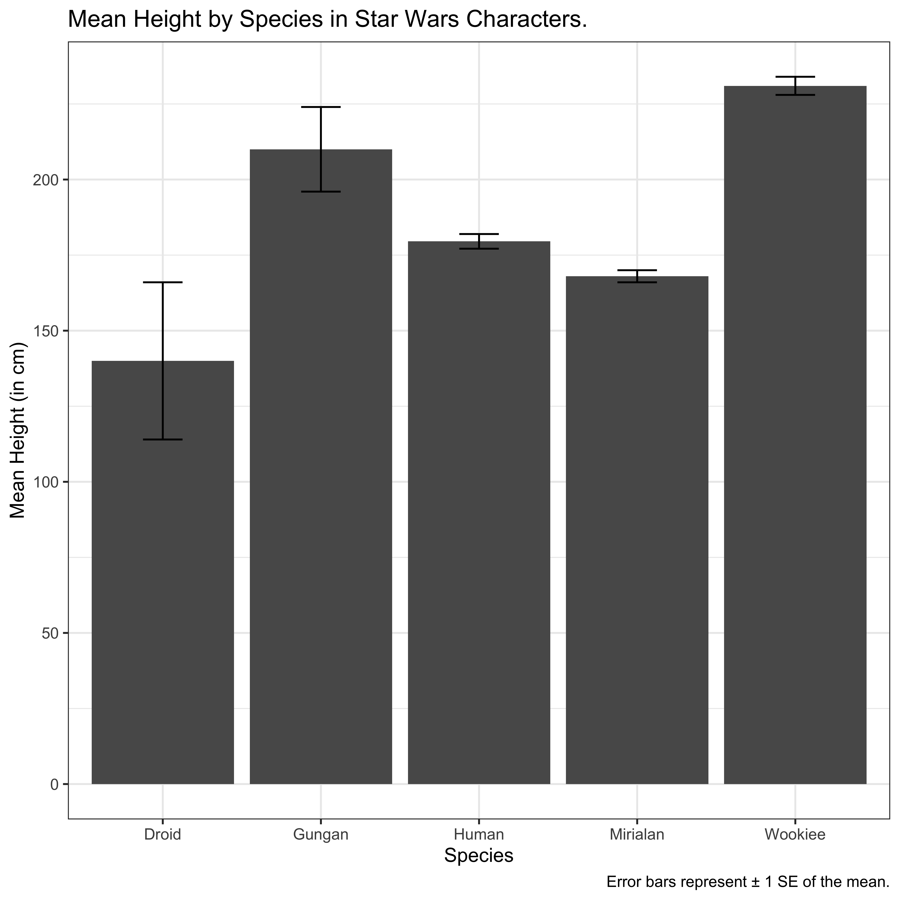

<style type="text/css">
.left-code {
  width: 58%;
  height: 92%;
  float: left;
}
.right-plot {
  width: 40%;
  float: right;
  padding-left: 1%;
}
.centre-plot[
  margin: auto;
  width: 25%;
]
</style>

```{r setup, include=FALSE}
options(htmltools.dir.version = FALSE)
set.seed(100)
library(tidyverse)
library(here)

options(tibble.print_min = 4)
knitr::opts_chunk$set(dpi = 600, retina = 1, warning = FALSE, out.width="75%")
```

```{r functions, include = FALSE}
colorise <- function(x, color) {
  if (knitr::is_latex_output()) {
    sprintf("\\textcolor{%s}{%s}", color, x)
  } else if (knitr::is_html_output()) {
    sprintf("<span style='color: %s;'>%s</span>", color, 
      x)
  } else x
}
```

# Exploring Different Geoms

We aren't restricted to dot plots in R, but we can make many different plots by using different geoms. For example:

- **Bar plots**: for displaying **count data**. Often used for scale data too (only safe is normally distributed with few outliers). Height of bar shows where scores lie.

- **Box plots**: for displaying **continuous (e.g. scale) data**. Shows interquartile range, median, and outliers.

- **Violin Plots**: like box plots, but shows **density of scores** (i.e. where scores are most common).

- **Density Plots**: for checking **distributions of data** (e.g. checking normality).

- **Histograms**: the same as density plots, but more **useful with fewer observations**.

```{r load-data}
data(starwars) # load data first
starwars <- filter(starwars, mass < 300) # filter out Jabba the Hutt
```


---
# Bar Plots for Count Data

.left-code[

For a **bar plot of count data**, we just need to pass a column of data to the aesthetics, and say it should appear on the x-axis.

We then use `geom_bar()` to make the bar plot.

This is what this looks like for counting up characters of different sexes.

```{r barplot, fig.show="hide"}
ggplot(data = starwars, mapping = aes(x = sex)) +
  geom_bar()
```

]

.right-plot[
`)
]

---
# Box Plots

.left-code[

What if we want to display a **continuous variable** across groups? A **boxplot** is handy here.

Let's get heights of characters from each sex. Now, we just add height to the y-axis, and change `geom_bar()` to `geom_boxplot()`

```{r boxplot, fig.show="hide", message = FALSE, warning = FALSE}
ggplot(
  data = starwars, 
  mapping = aes(x = sex,y = height)
) +
  geom_boxplot()
```

Remember, the dark line is the median, the box the middle 50% of scores. 

]

.right-plot[
`)

Lines represent the remainder, and dots represent outliers.

]

---
# Violin Plots

.left-code[

We can keep all code the same in the `ggplot()` call, but change the geom to `geom_violin()`.

```{r violinplot, fig.show="hide", message = FALSE, warning = FALSE}
ggplot(
  data = starwars, 
  aes(x = sex, y = height)
) +
  geom_violin(
    trim = FALSE,
    draw_quantiles = c(0.25, 0.5, 0.75)
  )
```

This takes some **optional arguments**. Here, I've told it to not trim the tails of scores, and to draw lines at the .25, .50, and .75 quantiles to be similar to a boxplot.

]

.right-plot[

`)
]

---
# Density Plots

.left-code[

We can see how a variable is distributed by making a **density plot**. Use `geom_density()` and only have variable mapped to the x-axis. (The y-axis is reserved for density.)

```{r density, fig.show="hide"}
ggplot(
  data = starwars, 
  aes(x = height)
) +
  geom_density()
```

]

.right-plot[
`)
]

---
# Density Plots by Group

.left-code[

We can see many categories for the variable by adding a variable to the `fill` argument.

I've also changed the alpha (opacity) in `geom_density()` so we can see overlapping data.

```{r densitycol, fig.show="hide", message = FALSE, warning = FALSE}
ggplot(
  data = starwars, 
  aes(x = height,fill = sex)
) +
  geom_density(alpha = 0.5)
```

]

.right-plot[
`)
]

---
# Histograms

.left-code[

This is usually used with few observations, but we'll use the same data here.

Change `geom_density()` to `geom_histogram()`. 

I've changed some the looks of the bars too using fill and colour arguments.

```{r histogram, fig.show="hide", message = FALSE, warning = FALSE}
ggplot(
  data = starwars, 
  mapping = aes(x = height)
) +
  geom_histogram(
    binwidth = 20,
    fill = "white",
    colour = "black"
  )
```
We have to set the binwidth here, which is how we group continuous scores into bars. **Large bins = big bars**. We'll remove sex from the fill aesthetic too.

]

.right-plot[

`)
]

---
# Faceting

Faceting allows us to **split our plots up into many panels**.

This is useful if we want to show patterns in data within groups.

There are two main facets, or ways of splitting data, in `ggplot2`:

- **facet_wrap()**: Split your data in to groups and automate how it will be displayed.

- **facet_grid()**: Split your data and define how it will be laid out in a grid.

Both take variables as arguments as such:

e.g. `facet_wrap(rows ~ columns)`. Variables in **rows** will be presented stacked vertically. Variables in **columns** will be presented side by side horizontally.

If you don't have a variable to present in e.g. **rows**, then put a full stop there, e.g. `facet_wrap(.~columns)`.

---
# Facet Wrap

.left-code[

Facet wrap wraps plots next to each other only for cases where we have the data to make a plot. It tries to **maximise plotting space**.

```{r facetwrap, fig.show="hide", message = FALSE, warning = FALSE}
ggplot(
  data = starwars, 
  mapping = aes(x = mass,y = height)
) +
  geom_point() +
  facet_wrap(.~sex)
```

]

.right-plot[
`)
]

---
# Facet Grid

.left-code[

Facet grid **completes cases** in your panel. So even missing combinations of data get a pane.

```{r facetgrid, fig.show="hide", message = FALSE, warning = FALSE}
ggplot(
  data = starwars, 
  mapping = aes(x = mass,y = height)
) +
  geom_point() +
  facet_grid(.~sex)
```
Data is only presented in dimensions that you ask it to be presented in (e.g. columns here).

]

.right-plot[

`)
]

---
# Saving Plots

We can save graphics from R using a number of methods, but for plots produced in `ggplot2`, we can use `ggsave()`.

We can either make our plot without assigning it to a variable, and then save it as follows:

```{r saving-last-plot, eval = FALSE}
ggplot(data = starwars, aes(x = height)) + 
  geom_density()

ggsave(here("myplot.png"), last_plot())
```

Or we can make a plot and assign it to a variable, and save it as follows:

```{r saving-variable, eval = FALSE}
my_plot <- ggplot(data = starwars, aes(x = height)) + 
  geom_density()

ggsave(here("myplot.png"), my_plot)
```

I prefer the latter. Why? Once a plot is stored as a variable, you can change it by adding `ggplot` arguments! For example...

```{r adding-to-plot-variables, eval = FALSE}
my_plot + coord_cartesian(xlim = c(0, 180))
```

---
# Putting it Together

We can make a summary of our data using tidyverse functions.

```{r starwars-desc, message = FALSE}
descriptives <- starwars %>% 
  group_by(species) %>% 
  summarise(
    total_n = n(),
    mean_height = mean(height, na.rm = TRUE),
    sd_height = sd(height, na.rm = TRUE)
  ) %>% 
  filter(total_n > 1) %>% 
  mutate(se_height = sd_height/sqrt(total_n))

# inspect our summary
descriptives
```

---
# Putting it Together

...and use this summary in plotting, or pipe it directly into `ggplot2`.

```{r starwars-desc-plot, fig.show = "hide"}
ggplot(
  data = descriptives, 
  mapping = aes(x = species, y = mean_height)
) +
  geom_bar(stat = "identity") +
  geom_errorbar(
    aes(
      ymin = mean_height - se_height, 
      ymax = mean_height + se_height
      ),
    width = 0.25
  ) +
  labs(
    title = "Mean Height by Species in Star Wars Characters.",
    caption = "Error bars represent \u00B1 1 SE of the mean.",
    x = "Species",
    y = "Mean Height (in cm)"
  ) +
  theme_bw()
```

---
# Putting it Together

```{r starwars-desc-plot-out, echo = FALSE, out.width = "500px"}

```

---
# Recap

We've learned...

- How and when to use **different types of plots** using `ggplot2`.

- How to set options within different **geoms** for our plots.

- How to differentiate between groups using **fill** and **facets**.

- How to **save plots** for use in your reports.

- How to **chain functions together** to make a summary, and then plot it!
